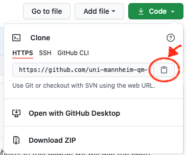
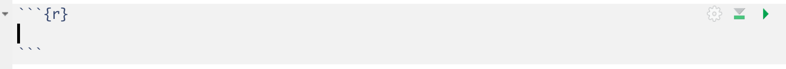
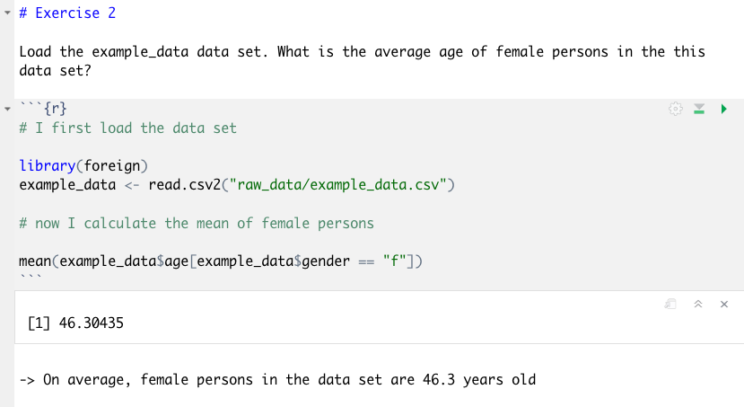

# Homework Assignment 3

This repository contains all the relevant materials for the first homework assignment. To work on the assignment, you have open the repository as a new project in RStudio on your computer. Note that we already did that with the material for the first lab sessions and it works in exactly the same way for this homework assignment. Nevertheless, we once more add instructions on how to open the project in RStudio below, just in case you still struggle with the process. 

## 1. How to **open the assignment in RStudio**

#### Get the URL of the repo for homework assignment

Go to [https://github.com/uni-mannheim-qm-2020](https://github.com/uni-mannheim-qm-2020) and click on the repository for the third homework (this week, this is is a combination of `hw03` and your `team`). On GitHub if you click on the repository you can see the other team members. Now, click on the green **Clone or download** button and select **Use HTTPS** (this might already be selected by default, and if it is, you’ll see the text Clone with HTTPS as in the image below). Click on the clipboard icon to copy the repo URL.

  

#### Import the repository in RStudio

  1. Open RStudio.
  2. Click on `File` on the top bar and select `New Project...`.

  

  3. Select `Version Control`. 
  4. In the next window, select `Git`.
  5. In the final window, paste the repo URL you grabbed from GitHub in the `Repository URL` window. Click on `Browse` to select the folder on your computer where you want to store the project.
  6. Click on `Create Project`.
  
## 2. How to **work with RMarkdown**

The repository for your homework contains the file `hw03.Rmd`. This is a so called "R Markdown"-file. We will work with .Rmd-files both in the lab sessions and in homework assignments. Working with R Markdown is super handy because you can combine text and code and you can export your results as a nice write-up in .html or .pdf format. You can find useful information about R Markdown [here](https://rmarkdown.rstudio.com/lesson-1.html), but you won't need much more than the following:

In .Rmd files, you can type R-code in so called chunks. They look like this:

  

You can write R-code within these chunks and answers to the questions outside. For the first homework, we already set up all chunks you need. If you however want to add more chunks, you can do so by clicking in `Insert` > `R` or by using the shortkey `Cmd+Shirt+I`. To run code, you can simply click on the green play icon. If you only want to run parts of your code, you can highlight the respective code and press`Cmd+Enter`.

Your answer to an exemplary assignment question could look like this:

  

## 3. How to collaborate with GitHub?

GitHub is excellent to collaborate, especially on code. To work together you just need to make sure to integrate regular `Pulls` into your workflow. Before you start working locally, `pull`, when you want to hand off to someone else, `commit` and `push`. 

If you are working on the same part of the assignment at the same time you will likely encounter merge conflicts. This means your try to `pull` will not work at once and you will have to consolidate the document before you can continue to work. This might seem painful at first, but in the long run this will ensure a nice collaborative workflow. Where no one can accidentally delete the work of other team members, like it could easily happen in e.g. a shared Dropbox. And all the changes and merges are recorded, so that you could also go back in time.

If you need to consolidate a document please have a look [at this guide](https://happygitwithr.com/) in Particular [Section 28](https://happygitwithr.com/pull-tricky.html#git-pull-with-local-commits). There are many different ways of how to 

## 4. How to **upload the finished assignment to GitHub**

Once you are done with the assignment, you need to save it on GitHub. This works exactly as with your individual assignments. Just make sure that one person in your team is responsible to upload the final version. You can actually do this at any time. For example, if you have a specific question for us, push your current version to GitHub so we can see where you're at. This is how you do it:

  1. Click on `Git` in the environment pane on the upper right.
  2. Click on `Commit`.
  3. Check oall boxes that appear in the upper left pane.
  4. Write a Commit Message in the upper right window. This is should describe the work you did since your last commit so that at a later point in time, you can easily keep track of your process. A message could be "Finished exercises 1 to 3.".
  5. Click on commit.
  6. **Important**: Click on `Push` to push the new version to GitHub.
  7. Now you can go to the repository on GitHub and check whether it is updated to the most current version of your assignment.

